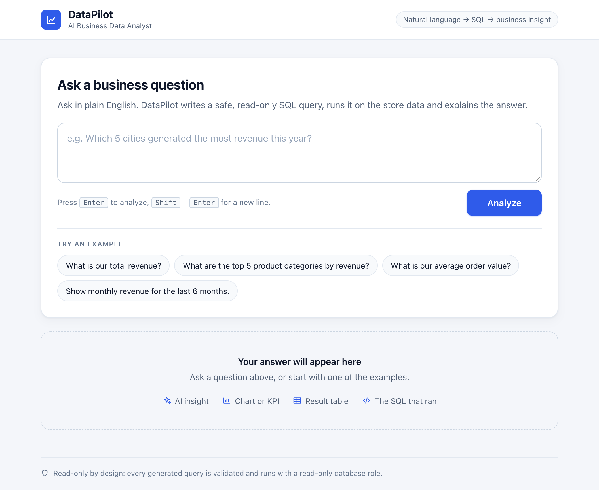
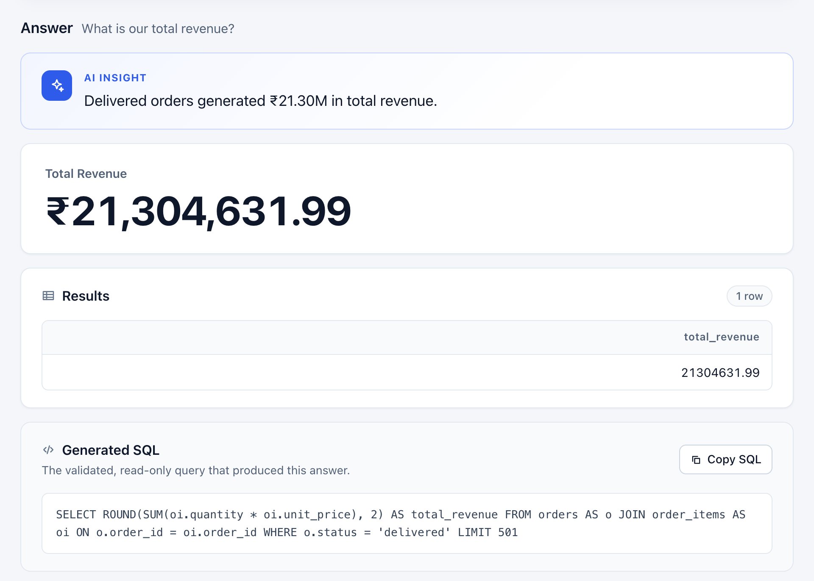
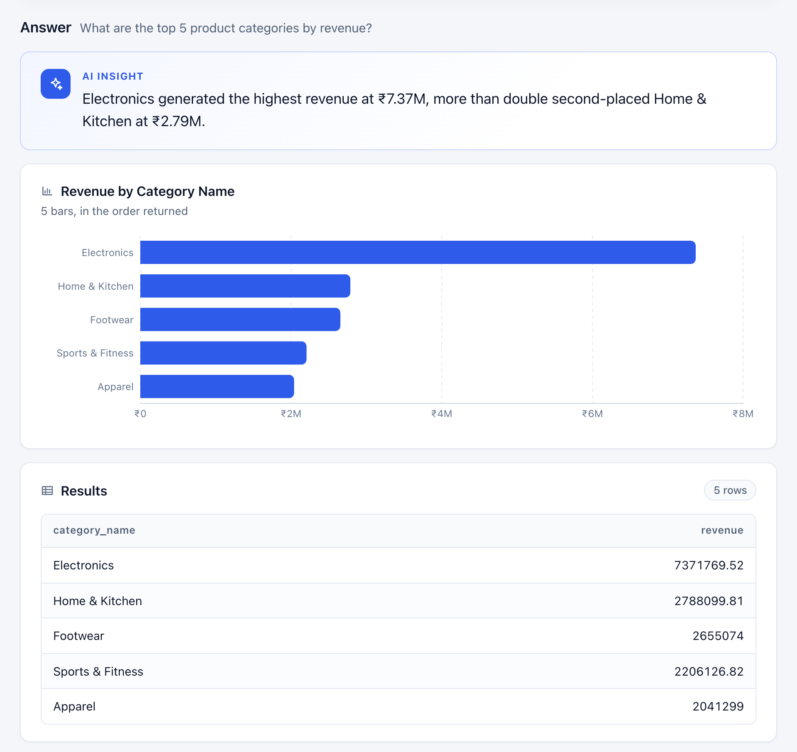

# DataPilot

**AI-Powered Business Data Analyst**

DataPilot lets you ask business questions in plain English. It turns each question into a
PostgreSQL query, checks that the query is safe and read-only, runs it against a business database,
and shows the answer as a KPI, chart or table, together with the SQL that ran and a short optional
AI insight. It is built around a fictional e-commerce store with synthetic data.

**Live app:** [data-pilot-flax.vercel.app](https://data-pilot-flax.vercel.app)

> DataPilot uses the Gemini API to write SQL. When Gemini's rate limits or availability are hit,
> questions can be temporarily unavailable; the app shows a clear "try again shortly" message.
> This is a limit of the external provider, not of the application.

## What DataPilot Does

```
Natural-language question
  → Gemini generates a PostgreSQL query
  → SQLGlot validates it (read-only, allowed tables and functions, row limit)
  → PostgreSQL runs it with a read-only role
  → DataPilot picks a KPI, bar chart, line chart or table
  → the frontend shows the result, the SQL that ran and an optional business insight
```

Example questions (all from the benchmark suite):

- What is our total revenue?
- What are the top 5 product categories by revenue?
- Show monthly revenue for the last 6 months.
- What is the profit margin for each category?
- How many customers have never placed an order?

## Screenshots

### Ask a business question



### Analyze business results



### Automatic visualization



The first screenshot is from the live deployment. The result screenshots use the real DataPilot
frontend with deterministic responses: the SQL ran against the project's real dataset through the
app's validator and read-only executor, and only the Gemini step was replaced, so the documentation
does not depend on external Gemini quota.

## Key Features

- **Plain-English questions** about revenue, profit, customers, products, orders and payments.
- **NL-to-SQL with Gemini**, using the database schema and fixed business definitions as context.
- **SQLGlot validation** of every generated query before it can run.
- **Dedicated read-only PostgreSQL role** for all application queries.
- **Deterministic visualization**: KPI, bar, line or table, chosen by fixed rules.
- **Optional AI insight**: a one- or two-sentence summary of the returned rows; if it fails, the
  result is still shown.
- **Visible SQL** for every answer, with a Copy SQL button.
- **Safe, structured errors** with friendly messages and no internal details.
- **Per-client rate limiting** to protect the AI quota.
- **Responsive interface** for desktop and mobile.
- **Deployed** on Vercel (frontend), Render (backend) and Supabase (database).
- **Benchmark and regression suite** of 25 business questions with trusted answers.

## Architecture

```
User
  → React + Vite frontend (Vercel)
  → FastAPI backend (Render)
       → Gemini API: writes SQL
       → SQLGlot validator
       → Supabase PostgreSQL, read-only role
       → chart selection and optional insight
  → JSON response rendered by the frontend
```

The backend runs one fixed pipeline: generate, validate, execute, choose a visualization, and
optionally summarise. The browser only ever talks to the backend; the AI key and database
credentials never leave it.

[Read the full architecture documentation](docs/architecture.md)

## Safety Model

**LLM-generated SQL is treated as untrusted input.** Safety does not rely on the prompt; it is
enforced by independent layers in code and in the database:

1. **Request checks**: body size cap, a single `question` field of 1 to 500 characters, rate limit.
2. **SQLGlot structural validation**: the query is parsed and its syntax tree is checked.
3. **Allowlists**: only the six business tables, the `public` schema and safe functions.
4. **No writes or admin SQL**: `INSERT`, `UPDATE`, `DELETE`, DDL, `GRANT`, row locks and multiple
   statements are rejected, including inside CTEs.
5. **Bounded queries**: a `LIMIT` is added or capped, and at most 500 rows are returned.
6. **Read-only database role**: `SELECT` on the six tables only, so writes fail at the database even
   if validation had a bug.
7. **Read-only transaction and timeout**: every query runs in a read-only, rolled-back transaction
   with a statement timeout.
8. **Safe error handling**: users see clear messages; stack traces, credentials and provider
   errors are never returned.

Gemini only returns text. It has no database connection and cannot run, approve or change anything.
This reduces risk through defence in depth; it does not make the system impossible to misuse.

[Read the full safety model](docs/safety-model.md) · [Security review](docs/security-review.md)

## Business Dataset

A fictional Indian e-commerce store, generated with Faker using a fixed seed (`42`):

| Table | Rows | Holds |
|---|---|---|
| `customers` | 1,000 | name, email, city, state, signup date |
| `categories` | 10 | product categories |
| `products` | 120 | name, category, current price and cost |
| `orders` | 5,000 | customer, order date, status |
| `order_items` | 9,241 | quantity, and the unit price and unit cost at the time of the order |
| `payments` | 5,257 | amount, method, status |

Orders run from 2024-10-01 to 2026-09-30, and the **dataset reference date is 2026-09-30**
("today" for questions like "last 6 months"). Historical profit uses `order_items.unit_cost`, the
cost captured when the order was placed, not the product's current cost.

## Business Definitions

| Metric | Definition |
|---|---|
| Revenue | `SUM(quantity × unit_price)` over delivered orders |
| Profit | `SUM(quantity × (unit_price - unit_cost))` over delivered orders |
| Average order value (AOV) | revenue / number of distinct delivered orders |
| Completed order | `orders.status = 'delivered'` |
| Successful payment | `payments.status = 'completed'` |

Cancelled and returned orders are excluded from revenue, profit and AOV unless a question asks
about them explicitly.

## Visualization Logic

| Result shape | Display |
|---|---|
| a single aggregate value | KPI |
| a category column and a numeric column | bar chart |
| a date/time column and a numeric column | line chart |
| anything else | table |

The choice is made by fixed rules in the backend, not by the LLM, so the same result always gets
the same display. The full result table is always shown as well.

## Tech Stack

| Layer | Technology |
|---|---|
| Frontend | React, Vite, Recharts |
| Backend | Python, FastAPI, Pydantic |
| Database | PostgreSQL on Supabase, psycopg |
| AI | Gemini API |
| SQL validation | SQLGlot |
| Synthetic data | Faker |
| Testing | pytest; Vitest and React Testing Library |
| Deployment | Vercel (frontend), Render (backend), Supabase (database) |

## Project Structure

```
DataPilot/
├── backend/
│   ├── app/              FastAPI app, pipeline, NL-to-SQL, validator, executor, charts, insights
│   └── requirements.txt
├── frontend/
│   ├── src/              React components, API client, formatting
│   └── package.json
├── database/             schema, seed data, read-only role setup scripts
├── tests/                backend tests
│   └── benchmark/        benchmark questions, trusted SQL and runner
├── docs/                 architecture, safety model, security review, benchmark, deployment
├── render.yaml           Render service definition
├── .env.example          backend environment variables (placeholders)
├── PROJECT.md            project blueprint and scope
└── TASKS.md              build plan and progress
```

## Running Locally

### Prerequisites

- Python 3.13 or newer (production uses 3.13)
- Node.js 20.19+ or 22.12+ (required by Vite)
- A PostgreSQL database; the project uses Supabase
- A Gemini API key

### 1. Clone

```bash
git clone https://github.com/satyamnirala187/DataPilot.git
cd DataPilot
```

### 2. Backend

```bash
python3 -m venv .venv
.venv/bin/pip install -r backend/requirements.txt
cp .env.example .env        # then fill in the values (see Environment Variables)
```

On Windows, use `.venv\Scripts\` instead of `.venv/bin/`.

**Set up the database** (only needed for a new, empty database; run from the project root with
`DATABASE_URL` set in `.env`):

```bash
.venv/bin/python database/apply_schema.py          # create the six tables (drops existing ones)
.venv/bin/python database/seed.py                  # load the synthetic data
.venv/bin/python database/create_readonly_role.py  # create the read-only role; writes READONLY_DATABASE_URL to .env
```

**Start the API:**

```bash
cd backend
../.venv/bin/uvicorn app.main:app --reload --port 8000
```

Check `http://localhost:8000/health`; interactive API docs are at `http://localhost:8000/docs`.

### 3. Frontend

In a second terminal:

```bash
cd frontend
cp .env.example .env.local  # VITE_API_BASE_URL=http://localhost:8000
npm install
npm run dev                 # http://localhost:5173
```

## Environment Variables

Backend (in the project-root `.env` locally, or in the Render dashboard):

| Variable | Purpose |
|---|---|
| `READONLY_DATABASE_URL` | connection for the read-only role; used by the running app for every query |
| `GEMINI_API_KEY` | Gemini API key |
| `CORS_ALLOWED_ORIGINS` | optional; JSON list of browser origins allowed to call the API (defaults to the local Vite origins) |
| `TRUST_CF_CONNECTING_IP` | optional; `true` only behind Cloudflare, as on Render, so rate limiting uses the real client IP |
| `DATABASE_URL` | admin connection for the setup scripts in `database/` only; not used by the running app |

Frontend (`frontend/.env.local`):

| Variable | Purpose |
|---|---|
| `VITE_API_BASE_URL` | URL of the backend API. Public, not a secret: it is built into the frontend bundle |

Never commit `.env` files. `.env.example` and `frontend/.env.example` contain placeholders only.

## Tests

Run from the project root unless noted:

```bash
.venv/bin/python -m pytest                    # backend tests
.venv/bin/python -m tests.benchmark.run       # offline benchmark (needs READONLY_DATABASE_URL)

cd frontend
npm test                                      # frontend tests
npm run lint
npm run build
```

Current results: **656 backend tests passed** and **66 frontend tests passed**. A few backend
integration tests use the database and are skipped when `READONLY_DATABASE_URL` is not set.

## Benchmark

- **25** business questions: **21** answerable correctness cases and **4** behaviour-only cases
  (unanswerable questions and prompt-injection or write attempts).
- **Offline: 21/21 evaluated answerable cases passed**; the 4 behaviour-only cases are skipped
  offline.
- **The live NL-to-SQL benchmark is still pending**, because Gemini quota and availability were
  unstable during development.

Offline mode runs trusted, hand-written SQL against the database. It is a regression and
consistency check of the expected answers, the validator, the executor and the chart rules, **not a
measure of Gemini's accuracy**.

[Benchmark methodology and results](docs/benchmark.md)

## Deployment

| Part | Platform |
|---|---|
| Frontend | Vercel |
| Backend | Render |
| Database | Supabase PostgreSQL |

The backend only accepts browser requests from configured frontend origins (CORS). The Gemini key
and database credentials stay on the backend, and the running app connects with the read-only role.

[Deployment guide](docs/deployment.md)

## Design Decisions

DataPilot needs a reliable path from question to SQL to result, with strong safety checks. It does
not need orchestration, so it avoids:

- **LangChain or agent frameworks**: one fixed pipeline with direct API calls is easier to read,
  test and debug.
- **A vector database**: the schema is six tables and fits directly in the prompt.
- **Extra infrastructure** (queues, caches, workers): one web service and one database are enough.

The project favours a simple architecture, deterministic safety, explainability and easy
debugging.

## Limitations

- No authentication in v1; the app is a public demo over synthetic data.
- The dataset is a synthetic e-commerce store, not real business data.
- Rate limiting is in memory, so it is per server process and resets on restart.
- Gemini availability and quota can make AI requests temporarily unavailable.
- Correct SQL for arbitrary, unseen questions is not guaranteed; the generated SQL is shown so it
  can be checked.
- The live Gemini benchmark has not been completed yet.
- DataPilot is a portfolio and demonstration project, not an enterprise analytics platform.

## Documentation

- [Architecture](docs/architecture.md)
- [Safety model](docs/safety-model.md)
- [Security review](docs/security-review.md)
- [Benchmark](docs/benchmark.md)
- [Deployment](docs/deployment.md)

## Project Status

- **Core product:** complete and deployed.
- **Documentation:** being finalised. README screenshots, a demo recording, a resume summary and a
  final project review are still to come.

## Author

**Satyam Nirala**: [github.com/satyamnirala187](https://github.com/satyamnirala187)
