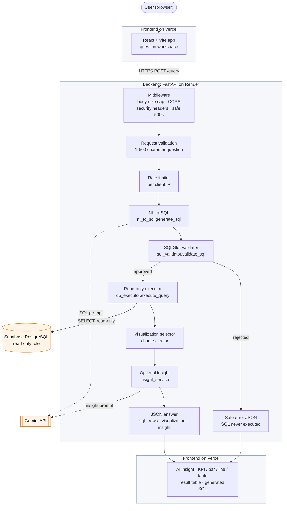

# DataPilot Architecture

How DataPilot is built today: what runs where, how a question becomes an answer, and why the
design is kept deliberately small. File and function names refer to this repository.

## 1. System Overview

A user types a business question in plain English. The React frontend sends it to the FastAPI
backend, which asks Gemini to write one PostgreSQL `SELECT`. That SQL is checked by a SQLGlot
validator and, only if approved, run against PostgreSQL through a read-only database role. The
backend then picks a display (KPI, bar chart, line chart or table) with fixed rules, optionally asks
Gemini for a one- or two-sentence insight about the returned rows, and sends everything back. The
frontend shows the insight, the visualization, the result table and the SQL that ran.

The model writes SQL and prose; it never touches the database directly and never decides what is
safe to run.

## 2. Architecture Diagram



Gemini and Supabase (orange) are external services; Vercel hosts the frontend, which appears twice
(sending the question, rendering the answer), and Render hosts the backend. Dotted arrows are calls
to Gemini. Every failure path (not only rejected SQL) ends in the same safe
error JSON, which the frontend shows as an error panel.

## 3. Request Lifecycle

1. **Login.** The app opens on a login page. `POST /auth/login` checks the shared demo username
   and password on the backend and returns a token valid for 2 hours, kept in `sessionStorage`.
   On reload, `GET /auth/session` confirms it before the workspace is shown.
2. **Question.** The user types a question (or picks an example) and presses Analyze or Enter.
   The frontend rejects an empty question itself.
3. **Request.** `frontend/src/services/api.js` sends `POST /query` with `{"question": "..."}` and
   `Authorization: Bearer <token>` to the URL in `VITE_API_BASE_URL`, with a 60-second timeout.
4. **Checks before any AI call.** The session is checked first: without a valid one the request
   gets 401 and nothing else runs. Middleware rejects bodies over 16 KB and only answers browser
   requests from the configured origins. `QueryRequest` accepts exactly one field, `question`,
   of 1–500 characters. The rate limiter allows 5 questions per 60 seconds per client, and a global
   cap allows a fixed number of questions per Pacific day from all clients together (both configurable).
5. **SQL generation.** `generate_sql` sends Gemini a system prompt containing the six-table schema,
   the business definitions and the SQL rules, with the user's question wrapped as untrusted data.
   Gemini must return structured JSON (`{"sql": ...}`). Transient failures (5xx, network) are
   retried twice, after 0.5 s and 1 s; other errors are not retried.
6. **Validation.** `validate_sql` parses the SQL with SQLGlot and checks the syntax tree: one
   statement, read-only (`SELECT` / `WITH … SELECT`, nothing that writes or locks, including inside
   CTEs), only the six tables, no blocked or amplifying functions, no cross joins or recursion, and
   a `LIMIT` (added or capped at 501: 500 rows plus one row that only shows whether more exist).
7. **Only approved SQL continues.** If validation fails, the request ends with HTTP 400
   `unsafe_sql`; the SQL is never sent to the database. The validator's rewritten SQL (for example
   with the added `LIMIT`) is what runs and what the user sees.
8. **Execution.** `execute_query` connects with `READONLY_DATABASE_URL` as the `datapilot_readonly`
   role, inside a read-only transaction that is always rolled back, with a statement timeout.
9. **Rows.** At most 500 rows are kept (`truncated` says if there were more), converted to
   JSON-friendly values. A result whose JSON exceeds `MAX_RESULT_BYTES` (default 1 MB) is refused.
10. **Visualization.** `select_visualization` chooses KPI, bar, line or table from the shape of the
   result (section 8). No model is involved.
11. **Insight.** If there are rows, `generate_insight` asks Gemini for a short summary of the first
    50 rows, the row count and the truncated flag. It is never retried.
12. **Insight failures are absorbed.** Any insight error sets `insight` to `null`; the query result
    is still returned with HTTP 200.
13. **Display.** The frontend renders the insight (or a quiet "Insight temporarily unavailable"
    note), the KPI or chart, the result table and the generated SQL.

The **query result is the authoritative answer**. The insight only describes those rows and can be
missing without affecting the result.

## 4. Backend Structure

All backend code is in `backend/app/`.

| Module | Responsibility |
|---|---|
| `main.py` | The FastAPI app: `GET /health`, `POST /query`, `POST /auth/login`, `GET /auth/session`, `POST /auth/logout`, the History and Saved Reports endpoints (`GET /history`, `GET /history/{id}`, `POST /saved-reports`, `GET /saved-reports`, `GET /saved-reports/{id}`), the request models, middleware order, exception handlers that map every error to `{"error": {"code", "message"}}`, and the rate-limit dependencies |
| `auth.py` | Private demo access: one shared login checked by the backend, short-lived HMAC-SHA256-signed bearer tokens (`v1.<expiry>.<session id>.<signature>`), in-memory logout revocation, and the `require_session` dependency that `/query` runs before anything else |
| `config.py` | `Settings` (pydantic-settings): database URL, Gemini key and model, CORS origins, rate limit, timeouts, row cap. Secrets are `SecretStr`, so they never appear in logs |
| `query_service.py` | The pipeline, `run_business_query`: generate → validate → execute → select visualization → optional insight. Defines `QueryResponse` and turns step failures into `QueryServiceError` kinds |
| `nl_to_sql.py` | The only code that asks Gemini for SQL: schema context, business definitions, SQL rules, untrusted-input rules, `generate_sql`, and `SQLGenerationError` |
| `sql_validator.py` | `validate_sql`: the SQLGlot safety checks and `LIMIT` enforcement. No network or database access, so it is tested on its own |
| `db_executor.py` | `execute_query`: runs approved SQL as the read-only role over TLS (always `sslmode=require` or stricter), with timeout and row and size caps; `to_json_value` converts PostgreSQL types; `QueryExecutionError` hides connection details |
| `history_store.py` | DataPilot's own data, as the `datapilot_app` role (`APP_DATABASE_URL`, TLS, 3-second statements, fixed SQL with bound parameters). `record_analysis` stores a successful answer and never raises (`saved` with the new id, `disabled` or `failed`); `list_history`, `get_analysis`, `save_report`, `list_saved_reports` and `get_saved_report` serve the API, scoped to an account, and raise `HistoryUnavailable` if the database cannot be used. The response models (`StoredAnalysis`, `AnalysisSummary`, ...) validate stored records before they are returned |
| `chart_selector.py` | `select_visualization` and the `Visualization` model (`type`, `x_key`, `y_key`) |
| `insight_service.py` | `generate_insight`: the optional summary prompt, a 15-second timeout, output length checks, and `InsightError` |
| `middleware.py` | Plain ASGI middleware: `RequestContext` (request ID and summary log line), `LimitRequestBody` (16 KB), `CatchUnexpectedErrors` (safe 500s that still carry CORS headers), `SecurityHeaders`, and `error_response` |
| `request_log.py` | Logging setup, request IDs and `QueryMetrics`: the outcome, stage timings and Gemini attempt count of one request, logged as a single `key=value` line |
| `client_ip.py` | `client_ip`: the rate-limit identity, from `CF-Connecting-IP` when `TRUST_CF_CONNECTING_IP` is on, otherwise the TCP peer. `X-Forwarded-For` is never used |
| `rate_limiter.py` | `RateLimiter`: an in-memory sliding window per client; `DailyLimit`: an in-memory count of questions per day (midnight to midnight Pacific time, like Gemini's quota) across all clients |

Middleware runs in this order for each request, outermost first: `SecurityHeaders` → CORS →
`RequestContext` → `CatchUnexpectedErrors` → `LimitRequestBody` → the route.

Setup scripts live in `database/` (`schema.sql`, `seed.py`, `readonly_role.sql`,
`create_readonly_role.py`, `apply_schema.py`, `api_roles.sql`, `revoke_api_roles.py`, and for the
planned History and Saved Reports `app_schema.sql`, `app_role.sql`, `create_app_role.py`). They use
the admin connection and are never part of the running API.

## 5. Frontend Structure

The frontend (`frontend/src/`) is a single page with plain React state; no router or state library.

| File | Responsibility |
|---|---|
| `App.jsx` | Page layout and request state (question, loading, result, error); prevents double submits; shows the empty state, loading skeleton, error panel or answer |
| `services/api.js` | The only module that calls the backend: `postQuery`, the timeout, and mapping HTTP errors to friendly titles and messages |
| `components/QuestionForm.jsx` | The question workspace: textarea (Enter submits, Shift+Enter adds a line), Analyze button, example questions |
| `components/InsightCard.jsx` | The AI insight, or the quiet unavailable note |
| `components/Visualization.jsx` | Draws exactly what the backend chose; it never picks a chart or columns itself |
| `components/KpiCard.jsx` | One value with a readable label, for example "Total Revenue ₹21,304,631.99" |
| `components/BarChartView.jsx`, `LineChartView.jsx` | Recharts charts (horizontal bars; a line in date order) |
| `components/ChartCard.jsx`, `ChartTooltip.jsx` | Shared chart frame and tooltip |
| `components/ResultsTable.jsx` | Row count, truncation note and the raw result table |
| `components/SqlViewer.jsx` | The generated SQL with a Copy SQL button |
| `components/ErrorMessage.jsx` | Error panel: amber for temporary problems, red otherwise |
| `utils/format.js` | All display formatting: ₹ for money-like columns, % for percentage columns, labels, dates |

## 6. Database

A fictional Indian e-commerce store with synthetic data generated by `database/seed.py`
(Faker, fixed seed, orders from 2024-10-01 to 2026-09-30):

| Table | Holds | Rows |
|---|---|---|
| `customers` | name, email, city, state, country, signup date | 1,000 |
| `categories` | product categories | 10 |
| `products` | name, category, **current** price and cost, stock | 120 |
| `orders` | customer, order date, status | 5,000 |
| `order_items` | product, quantity, and the unit price and **unit cost at the time of the order** | 9,241 |
| `payments` | order, amount, method, status, date | 5,257 |

```
customers ──< orders ──< order_items >── products >── categories
                 └──< payments
```

**Historical data:** `order_items.unit_price` and `order_items.unit_cost` are captured when the
order is placed. Revenue and profit use them, so historical figures stay correct if a product's
current `products.price` or `products.cost` changes later. Profit never uses `products.cost`.

**Read-only role:** the API connects only as `datapilot_readonly` (`database/readonly_role.sql`):
`SELECT` on the six tables and nothing else, no inherited privileges, a connection limit, and every
session read-only by default with a 5-second statement timeout.

**Application data (History and Saved Reports, live in production):** DataPilot's own data lives apart from the business data, in schema `datapilot` (`database/app_schema.sql`):

| Table | Holds |
|---|---|
| `datapilot.analyses` | one row per successful analysis: a snapshot of the question, the SQL that ran, the columns and rows, row count, truncation flag, chart spec and insight, with `account_id` and `created_at` |
| `datapilot.saved_reports` | an analysis the user chose to keep: a title and a reference to the analysis (at most one report per analysis), never a copy of it |

It is written by a second role, `datapilot_app` (`database/app_role.sql`), with its own connection
string, `APP_DATABASE_URL`: `SELECT` and `INSERT` on those two tables only, no `UPDATE` or `DELETE`,
and no access to the business tables. `datapilot_readonly`, which runs the generated SQL, has no
access to schema `datapilot`. `schema.sql` never touches it, so reseeding the business data keeps
every analysis and saved report. The schema and role exist in the hosted database and are verified
by live tests.

**Automatic History recording:** after `run_business_query` has
returned a successful answer, the `/query` endpoint stores it with `history_store.record_analysis`
and returns the new row's id as `analysis_id`. Only complete answers are stored, including those
with no rows or no insight; any request that fails (login, validation, rate limits, Gemini,
validator, database) stores nothing. The snapshot is exactly what the user received, so reopening it
later never reruns Gemini or the SQL. Records belong to the account, not the session: the one shared
demo login is account `demo` (`auth.DEMO_ACCOUNT_ID`), so History survives logout and new sessions.
History is secondary to the answer: if storing fails or `APP_DATABASE_URL` is not set, the full
answer is still returned with HTTP 200 and `analysis_id: null`.

**History and Saved Reports API:** every endpoint
needs a demo session (checked first), then has its own limit of 60 requests per minute per client,
separate from the `/query` limits and the daily cap. Everything is read from the stored snapshots:
no endpoint calls Gemini, regenerates SQL, runs a stored query or uses the daily cap.

| Endpoint | Returns |
|---|---|
| `GET /history?limit=50` (1-100) | `{"items": [{"id", "question", "visualization_type", "row_count", "truncated", "created_at", "saved_report_id"}]}`, newest first; no rows or SQL |
| `GET /history/{analysis_id}` | `{"id", "question", "sql", "columns", "rows", "row_count", "truncated", "visualization", "insight", "created_at", "saved_report": {"id", "title"} or null}`, the same field names as a `/query` answer |
| `POST /saved-reports` with `{"analysis_id", "title"}` | 201 `{"id", "analysis_id", "title", "saved_at"}`. The title is trimmed, 1-120 characters, no control characters; no other fields are accepted, so a report's content is always the stored analysis |
| `GET /saved-reports?limit=50` (1-100) | `{"items": [{"id", "analysis_id", "title", "question", "visualization_type", "row_count", "truncated", "saved_at", "analysis_created_at"}]}`, most recently saved first |
| `GET /saved-reports/{report_id}` | `{"id", "title", "saved_at", "analysis": {...the stored analysis...}}` |

Errors: 404 `analysis_not_found` or `report_not_found` (the same for an id that does not exist and one
that belongs to another account), 409 `already_saved` (one report per analysis), 400
`invalid_request` (malformed id, limit or title), 429 `too_many_requests`, and 503
`history_unavailable` whenever the History database cannot be used, including when
`APP_DATABASE_URL` is not set: an empty list would wrongly say there is no History. There is no
delete or edit in V1: `datapilot_app` has only `SELECT` and `INSERT`. Timestamps are ISO 8601 in UTC.

**Production status:** live since Phase 19, with `APP_DATABASE_URL` set on Render; production
storage and every endpoint were verified after the rollout. The one shared demo login is one account,
so every demo visitor sees the same History and Saved Reports. There is no History or Saved Reports
screen yet: the current frontend ignores `analysis_id` until UI V2.

## 7. Business Semantics

These definitions are written into the NL-to-SQL prompt and into the benchmark's trusted SQL:

| Term | Definition |
|---|---|
| Dataset reference date | 2026-09-30, treated as "today" for relative dates such as "last 6 months" |
| Completed order | `orders.status = 'delivered'` |
| Successful payment | `payments.status = 'completed'` |
| Revenue | `SUM(order_items.quantity * order_items.unit_price)` over delivered orders |
| Profit | `SUM(order_items.quantity * (order_items.unit_price - order_items.unit_cost))` over delivered orders |
| Average order value | revenue / number of distinct delivered orders |

Cancelled and returned orders are excluded from revenue, profit and AOV unless the question asks
about them explicitly. Questions about numbers or shares of orders count all orders unless the
question says otherwise.

## 8. Visualization Decision Logic

`chart_selector.select_visualization` looks only at the result's shape:

| Result | Display |
|---|---|
| one row, one numeric value | KPI |
| 2–50 rows, one text column + one numeric column | bar chart |
| 2+ rows, one date/time column + one numeric column | line chart |
| anything else: no rows, several numeric columns, three or more columns, mixed or unclear types | table only |

The rules are deterministic: the same result always gets the same display, it can be unit-tested,
and it costs no extra model call. If anything is unclear the answer is "table", and the table is
always shown below any chart.

## 9. Deployment Architecture

| Part | Where | Notes |
|---|---|---|
| Frontend | Vercel | Static build of the Vite app; its only setting is the public `VITE_API_BASE_URL` |
| Backend | Render | One web service, `uvicorn … --workers 1 --no-proxy-headers` (`render.yaml`) |
| Database | Supabase PostgreSQL | Reached through Supabase's session pooler as the read-only role |
| AI provider | Gemini API | Called only by the backend |

- The browser calls the Render API directly; Vercel serves static files only.
- `CORS_ALLOWED_ORIGINS` allows the production Vercel origin plus the localhost development origins.
- The Gemini key and database URL exist only as Render environment variables. The frontend bundle
  contains no secrets.
- The running API only has `READONLY_DATABASE_URL`. The admin `DATABASE_URL` is used by the setup
  scripts and is not configured on Render.
- Render's proxy sits in front of the app, so the rate limiter identifies clients by Cloudflare's
  `CF-Connecting-IP` header (`TRUST_CF_CONNECTING_IP=true`).

Step-by-step setup is in [`deployment.md`](deployment.md).

## 10. Design Decisions

The guiding idea is simple, reliable and explainable rather than clever:

- **FastAPI**: small, typed (Pydantic request and response models) and gives `/docs` for free.
- **React + Vite**: a standard, fast frontend toolchain for a single interactive page.
- **PostgreSQL**: a real relational database with roles, read-only transactions and statement
  timeouts, which the safety model relies on.
- **Gemini**: turns questions into SQL and writes the short insight, through direct API calls with
  structured JSON output.
- **SQLGlot**: checks the parsed syntax tree, not the SQL text, so tricks such as comments, odd
  casing or a write hidden in a CTE are caught.
- **Deterministic visualization**: predictable, testable and free, instead of asking the model.
- **Read-only database role**: a second, independent guarantee; writes fail at the database even if
  the validator had a bug.
- **No LangChain or agent framework**: one fixed pipeline with direct calls is easier to read,
  test and explain.
- **No vector database**: the schema is six tables and fits directly in the prompt.
- **No queues, caches, workers or extra services**: one web service and one database are enough for
  this workload. The in-memory rate limiter assumes that single process.

## 11. Failure Isolation

Each failure ends in a specific, safe response; none exposes stack traces, credentials or raw
provider errors.

| Failure | What happens |
|---|---|
| Gemini rate-limits SQL generation | HTTP 429 `rate_limited`, never retried; a `Retry-After` header when Gemini sends a usable retry delay, and a more specific message when its quota metadata shows a temporary limit or an exhausted quota |
| Gemini unavailable (5xx or network, after two retries) | HTTP 503 `generation_unavailable` |
| Gemini returns an empty or malformed answer | HTTP 502 `generation_failed` |
| Generated SQL fails validation | HTTP 400 `unsafe_sql`; the SQL is never executed |
| Database refuses the query (permissions) | HTTP 400 `query_not_allowed` |
| Query error (for example an unknown column) | HTTP 422 `query_failed` |
| Result larger than `MAX_RESULT_BYTES` | HTTP 422 `result_too_large`; nothing partial is returned and no insight is requested |
| Query exceeds the statement timeout | HTTP 504 `query_timeout` |
| Database unreachable | HTTP 503 `database_unavailable` |
| Insight generation fails for any reason | HTTP 200 with the full result and `insight: null` |
| Storing History fails, or `APP_DATABASE_URL` is not set | HTTP 200 with the full result and `analysis_id: null`; logged as `history_status=failed` or `disabled`, never with connection details |
| History or Saved Reports API cannot use the database (or `APP_DATABASE_URL` is not set) | HTTP 503 `history_unavailable`; logged as `event=history_unavailable` with the endpoint and a fixed cause only |
| No valid demo session (missing, expired, revoked or forged token) | HTTP 401 `unauthorized`; the frontend returns to the login page. No rate-limit slot, daily-cap unit, Gemini call or query is used |
| Wrong demo username or password | HTTP 401 `invalid_credentials`, the same for either |
| Too many login attempts from one client | HTTP 429 `too_many_login_attempts` with a `Retry-After` header |
| Too many questions from one client | HTTP 429 `too_many_requests` with a `Retry-After` header |
| Daily question cap reached (all clients) | HTTP 429 `daily_limit_reached`, `Retry-After` until midnight Pacific time; the pipeline is not called |
| Request body over 16 KB | HTTP 413 `request_too_large` |
| Any unexpected server error | HTTP 500 `internal_error` with a generic message; the exception type and code location stay in the server log |

On the frontend, temporary problems (rate limits, unavailable services, timeouts, an unreachable
backend) are shown as calm amber notices; other errors as red panels. An unavailable insight is
never shown as an error.

### Request logs

Every response carries a random `X-Request-ID` header, and every `POST /query` produces exactly
one summary line on the `app.request_log` logger, at INFO for successes, WARNING for handled errors
and ERROR for unexpected ones:

```
event=query_complete request_id=9b2e41f07ac3d158 outcome=success status=200 question_length=34 total_ms=2481 gemini_sql_attempts=1 sql_ms=1630 validation_ms=4 db_ms=212 rows=5 truncated=false visualization=bar insight_status=success insight_ms=611
event=query_complete request_id=51c7d0e2a94b6f83 outcome=error status=429 error_kind=rate_limited stage=sql cause=gemini_rate_limited limit_type=quota_exhausted retry_after=40 question_length=21 total_ms=388 gemini_sql_attempts=1 sql_ms=377
```

- `error_kind` is the code the client received; `stage` (`request`, `app_rate_limit`, `sql`,
  `validation`, `db`, `internal`, `auth`) and `cause` say where and why. Causes include `app_rate_limited`
  (DataPilot's per-client limit) and `global_daily_limit` (its daily cap) versus `gemini_rate_limited`, `gemini_unavailable`, `gemini_timeout`,
  `gemini_invalid_response`, `validator_rejected`, `db_timeout`, `db_unavailable`,
  `db_query_error` and `db_result_too_large`; an unexpected exception gives its type.
- `gemini_sql_attempts` is counted as attempts happen; `sql_ms` includes the waits between retries.
- `insight_status` is `success`, `failed` (with `insight_error`), `skipped_budget` or
  `skipped_empty`.
- `history_status` (successful answers only) is `saved`, `disabled` (no `APP_DATABASE_URL`) or
  `failed` (with `history_error`: `unavailable`, `timeout`, `insert_failed`,
  `invalid_configuration`, or an unexpected exception's type), plus `history_ms`. A `failed` History
  write keeps `outcome=success` but logs the line at WARNING. The `analysis_id` is not logged.

A History or Saved Reports request that gets 503 logs one WARNING line,
`event=history_unavailable request_id=... endpoint=history_detail cause=timeout`: the endpoint's
name and the store's error kind only, never ids, titles, questions, SQL or connection details.
- Timings are whole milliseconds from a monotonic clock. Fields that do not apply are left out.

The line never contains the question (only its length), the generated SQL, result rows, client
addresses, connection strings, the API key or provider error bodies. Gemini and validator messages
are not logged either, because they can quote the question or the SQL. Library loggers such as
httpx stay at WARNING, so request URLs are not logged.
